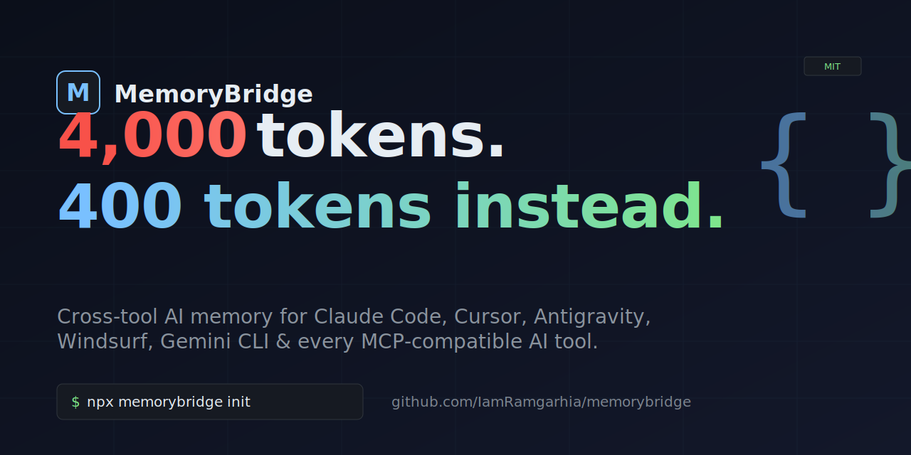
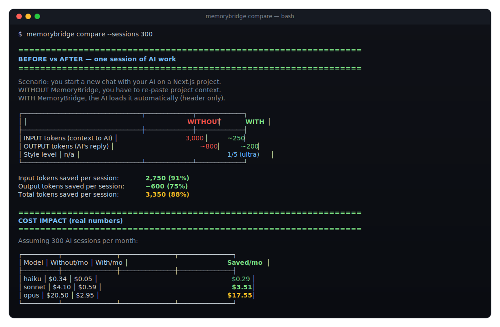
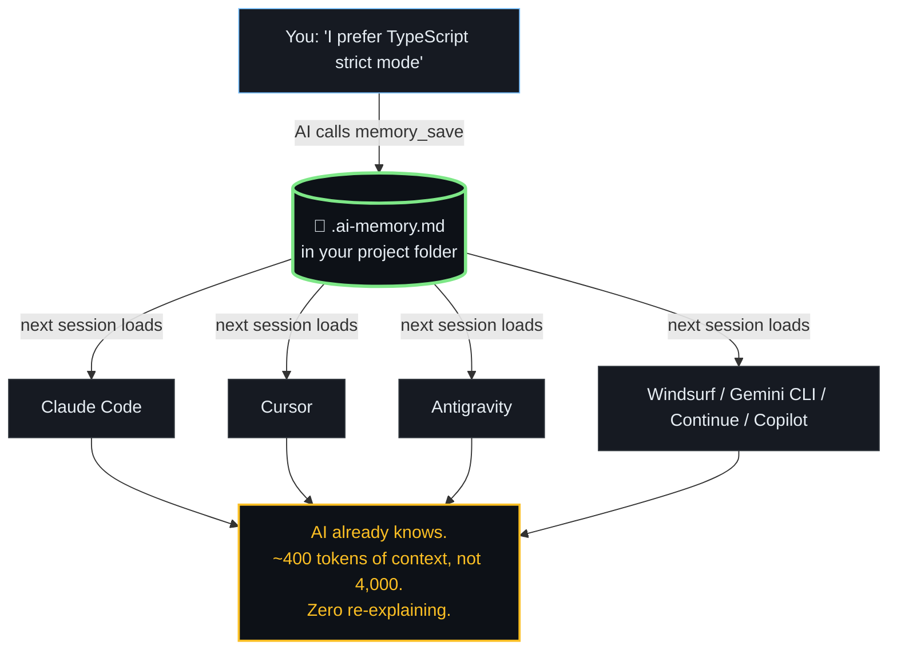
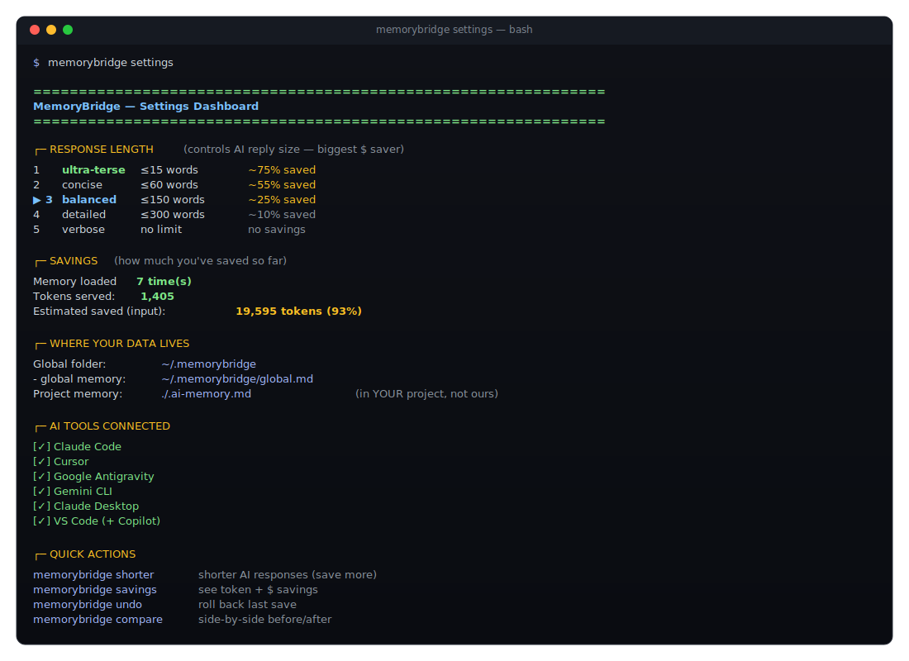

<p align="center">
  
</p>

# MemoryBridge — Cross-Tool AI Memory for Claude Code, Cursor, Antigravity & every MCP-compatible AI

> **One file. Every AI. 400 tokens, not 4,000.**

<p align="center">
  <a href="https://opensource.org/licenses/MIT"></a>
  <a href="https://nodejs.org/">=20"></a>
  <a href="https://modelcontextprotocol.io/"></a>
  <a href="https://www.typescriptlang.org/"></a>
  <a href="https://glama.ai/mcp/servers/IamRamgarhia/memorybridge"></a>
</p>

**MemoryBridge** is an MCP (Model Context Protocol) server that gives every AI coding tool you use — **Claude Code, Cursor, Google Antigravity, Windsurf, Gemini CLI, Continue.dev, VS Code Copilot, Claude Desktop** — a shared memory of your project. One Markdown file (`.ai-memory.md`) lives in your project folder. Every AI tool reads it on session start. You stop re-explaining your stack, decisions, and known bugs every time you start a new chat.

**Why it matters:** developers on $20/month AI plans burn through their quota re-pasting project context. MemoryBridge cuts that overhead by **~94% on input tokens** and **up to 75% on output tokens** (with the built-in response-style toggle). On a Sonnet-class model at heavy usage, that's $50–$100/month back in your pocket.

---

## 📑 Table of contents

- [⚡ Quick install](#-quick-install)
- [📖 Step-by-step guide (first time using MemoryBridge)](#-step-by-step-guide-first-time-using-memorybridge)
- [🎯 The problem MemoryBridge solves](#-the-problem-memorybridge-solves)
- [✨ What you get](#-what-you-get)
- [🆚 How it compares](#-how-it-compares)
- [🚀 60-second walkthrough](#-60-second-walkthrough)
- [📊 Real token savings (measured)](#-real-token-savings-measured)
- [🔧 How it works](#-how-it-works)
- [🎛️ One dashboard for everything](#️-one-dashboard-for-everything)
- [🛠️ CLI reference](#️-cli-reference)
- [❓ FAQ](#-faq)
- [🔎 Common questions (long-form)](#-common-questions-long-form)
- [🤝 Contributing](#-contributing)
- [🔒 Safety](#-safety)
- [📄 License](#-license)

---

## ⚡ Quick install

```bash
npx memorybridge init
```

That's it. The installer auto-detects your AI tools and wires `memorybridge` into each one's MCP config. Restart your AI tool and you're done.

> Currently you can run from source while we finalize the npm publish. See [Manual install](#-manual-install-while-we-publish).

---

## 📖 Step-by-step guide (first time using MemoryBridge)

If you've never used an MCP server before, follow these eight steps. Total time: ~5 minutes.

### Step 1 — Prerequisites

You need:

- **Node.js 20 or newer** ([download](https://nodejs.org/)) — check with `node --version`
- **At least one MCP-compatible AI tool installed**: Claude Code, Cursor, Google Antigravity, Windsurf, Gemini CLI, Continue.dev, VS Code (+ Copilot), or Claude Desktop

That's it. No Docker, no databases, no API keys.

### Step 2 — Install MemoryBridge

**Option A — npx (recommended, when published to npm):**

```bash
npx memorybridge init
```

**Option B — Clone and build from source (right now):**

```bash
git clone https://github.com/IamRamgarhia/memorybridge.git
cd memorybridge
npm install
npm run build
node dist/cli.js init
```

You'll see output like:

```
=== MemoryBridge Init ===

  Configured:
    [✓] Claude Code    added    ~/.claude.json
    [✓] Cursor         added    ~/.cursor/mcp.json

  Next steps:
    1. Restart your AI tool(s) so they pick up the MCP config.
    2. cd into a project, then run: memorybridge add "<your first memory>"
```

### Step 3 — Restart your AI tool

This is **required**. AI tools read their MCP config only on startup, so quit (fully close) and reopen Claude Code, Cursor, or whichever tool you use.

### Step 4 — Verify it's working

Open your AI tool, then ask:

> *"What MCP tools are available to you?"*

You should see **`memory_load`**, **`memory_save`**, and **`memory_search`** in the list. If you don't, run `memorybridge doctor` from your terminal — it'll diagnose the issue.

### Step 5 — Use it normally (the AI saves automatically)

Open any project folder in your AI tool. Tell it something durable about your project:

> *"This project uses Supabase for auth instead of NextAuth. Remember that."*

The AI will call `memory_save` and persist this to `.ai-memory.md` in your project folder. You can verify:

```bash
cat .ai-memory.md
```

You'll see:

```markdown
## @decisions
- [2026-05-28] Auth chosen: Supabase over NextAuth
```

That's it — MemoryBridge is now active. **Every future session in this folder, regardless of which AI tool you use, will start by reading this file.**

### Step 6 — See what you've saved

Three ways to look at your memory:

```bash
memorybridge open                # opens .ai-memory.md in your default editor
memorybridge list                # CLI listing of every entry
memorybridge load                # exactly what the AI sees on session start
memorybridge settings            # one-page dashboard with everything
```

### Step 7 — Tune for max token savings

```bash
memorybridge shorter             # cut AI response length (saves output tokens)
memorybridge style 1             # jump straight to "ultra-terse" (~75% output saved)
memorybridge savings             # see real measured + estimated savings
memorybridge compare             # side-by-side before/after with $ math
```

Output tokens cost **5× more** than input tokens, so the style toggle is the biggest dollar saver. Start at level 3 (balanced) and tighten if you want shorter answers.

### Step 8 — Roll back or uninstall anytime

**Undo a bad save** (preserves every snapshot):

```bash
memorybridge undo                # restore the previous version
memorybridge log                 # see snapshot history with timestamps
memorybridge diff 3              # diff current vs 3 snapshots ago
```

**Uninstall cleanly** (preserves your `.ai-memory.md` files in projects):

```bash
memorybridge uninstall           # remove MemoryBridge from all MCP configs
memorybridge uninstall --purge   # also delete ~/.memorybridge/ folder
```

After uninstalling, your project's `.ai-memory.md` files are still there — they're your data, not ours. Delete them manually if you don't want them.

---

---

## 🎯 The problem MemoryBridge solves

Every AI tool forgets your project the moment a session ends:

- **Vibe coders** re-paste "this is a Next.js app using Supabase…" every single session
- **Pros switching between Claude Code and Cursor** start over from zero each time
- **Teams** lose architecture decisions because nothing remembers them between hires
- **Users on cheaper plans** burn their token quota explaining context the AI already heard yesterday

21+ frameworks exist to solve this. None work across every tool, are free, and small enough to run locally. MemoryBridge is.

---

## ✨ What you get

| Feature | What it does |
|---|---|
| 🧠 **Cross-tool memory** | One `.ai-memory.md` file works in Claude Code, Cursor, Antigravity, Windsurf, Gemini CLI, and any MCP-compatible AI |
| ⚡ **Token frugality** | Default `memory_load` returns ~400 tokens (vs Mem0's typical 2,000–5,000) |
| 🎚 **Response-length toggle** | 5 levels — ultra-terse to verbose — controls AI output size, your biggest $-saver |
| 📁 **Project-local file** | Memory lives in your project folder, travels with your repo, can be Git-versioned for team sharing |
| 🛡️ **Safe writes** | Banner + SHA-1 hash protection — refuses to overwrite hand-written `AGENTS.md`/`CLAUDE.md`/`.cursorrules` |
| ↩️ **Memory undo** | Every save is snapshotted. `memorybridge undo` rolls back. No git dependency. |
| 🔀 **Universal emitter** | Generate `AGENTS.md`, `CLAUDE.md`, `.cursorrules`, `.windsurfrules`, `GEMINI.md`, `.continuerules`, Copilot instructions — all from one source |
| 🔍 **Cross-project search** | `memorybridge global-search "supabase"` searches every indexed project at once |
| 📊 **Real savings dashboard** | `memorybridge savings` shows actual measured tokens served + dollar estimates per tier |
| 🗺️ **Symbol extraction** | `memorybridge symbols save` extracts exports from JS/TS/Py/Go so AI doesn't re-grep |
| 🔒 **Zero cloud, zero accounts** | Everything is a local file. No telemetry. No vendor lock-in. |
| ↪️ **Clean uninstall** | `memorybridge uninstall` cleanly reverses everything |

---

## 🆚 How it compares

| | Mem0 | CLAUDE.md | basic-memory | ChatGPT Memory | **MemoryBridge** |
|---|---|---|---|---|---|
| Works across all AI tools | ❌ | ❌ | ⚠️ | ❌ | **✅** |
| Zero setup | ❌ | ⚠️ | ⚠️ | ✅ | **✅** |
| Plain markdown (no DB) | ❌ | ✅ | ✅ | ❌ | **✅** |
| File lives in project folder | ❌ | ✅ | ❌ | ❌ | **✅** |
| Token-frugal (< 500 tokens default) | ❌ | ⚠️ | ❌ | ❌ | **✅** |
| Controls AI output length | ❌ | ❌ | ❌ | ❌ | **✅** |
| Shows real savings ($ + tokens) | ❌ | ❌ | ❌ | ❌ | **✅** |
| AGENTS.md / .cursorrules emitter | ❌ | ❌ | ❌ | ❌ | **✅** |
| Memory undo | ❌ | manual git | ❌ | ❌ | **✅** |
| Local, no cloud, no accounts | ⚠️ | ✅ | ✅ | ❌ | **✅** |

---

## 🚀 60-second walkthrough

```bash
# 1. Install (auto-detects Claude Code, Cursor, Antigravity, etc.)
npx memorybridge init

# 2. See everything in one dashboard
memorybridge settings

# 3. Use any AI tool in any project. When you say "I prefer TypeScript strict mode",
#    the AI calls memory_save automatically. Next session, it already knows.

# 4. Make AI responses shorter to save output tokens (5× cost vs input)
memorybridge shorter

# 5. Watch real savings accumulate
memorybridge savings

# 6. Generate AGENTS.md, CLAUDE.md, .cursorrules — all from one source
memorybridge emit --all

# 7. Search across every project you've ever worked on
memorybridge global-search "supabase"

# 8. Roll back a bad memory save
memorybridge undo
```

---

## 📊 Real token savings (measured)

<p align="center">
  
</p>

After 7 calls in a test project:

```
INPUT token savings (vs. re-pasting ~3,000 tokens of context per session):
  Baseline:        21,000 tokens
  Actual served:   1,405 tokens
  Saved:           19,595 tokens (93%)

OUTPUT token savings (style level 2 — concise):
  Estimated saved: 2,640 tokens (55%)
```

At 500 sessions/month on Sonnet, you save roughly **$6.50/month**. At 100 sessions on Opus you save **$3.40/month**. Heavy users on Opus see **$23+/month**. Run `memorybridge compare --sessions 500` to see your projected savings.

> **Honest disclaimer:** "Tokens saved" assumes a 3,000-token re-paste baseline per session. If you don't re-paste, savings are smaller. If you re-paste more, savings are larger. Tokens *served* (1,405 above) are real, measured by `gpt-tokenizer` on the actual returned text.

---

## 🔧 How it works



---

## 🎛️ One dashboard for everything

<p align="center">
  
</p>

`memorybridge settings` shows your current style level, savings so far, every file path MemoryBridge knows about, which AI tools are wired up, and the exact command to change each one. Run it any time.

---

## 🛠️ CLI reference

| Command | What it does |
|---|---|
| `memorybridge init` | Detect AI tools and wire MemoryBridge into their MCP configs |
| `memorybridge uninstall [--purge]` | Cleanly remove (preserves your data unless `--purge`) |
| `memorybridge settings` | Single-page dashboard — everything tunable + current values |
| `memorybridge savings` | Token + $ savings, measured + estimated |
| `memorybridge compare [--sessions N]` | Side-by-side before/after with cost math |
| `memorybridge scan` | Show all installed AI tools + their existing memory files |
| `memorybridge add <text> [--category X]` | Manually save a memory entry |
| `memorybridge list` | Show all saved memories |
| `memorybridge search <query>` | Search current project memory |
| `memorybridge global-search <query>` | Search across ALL indexed projects |
| `memorybridge index [--root <path>]` | Rebuild cross-project index |
| `memorybridge projects` | List indexed projects |
| `memorybridge load [--section X]` | Preview what AI sees on session start |
| `memorybridge show` | Alias for `load` |
| `memorybridge open` | Open the memory file in your editor |
| `memorybridge doctor` | Verify install, paths, token budget |
| `memorybridge quality` | Score your memory for junk content (grade A–F) |
| `memorybridge compact [--days N]` | Archive entries older than N days (default 90) |
| `memorybridge emit [<format>] [--all] [--dry-run] [--force]` | Generate AGENTS.md / CLAUDE.md / .cursorrules / etc. |
| `memorybridge style 1\|2\|3\|4\|5\|off\|bigger\|smaller` | Control AI response length |
| `memorybridge shorter` / `longer` | Step style by one |
| `memorybridge pin <section>` / `unpin` / `pins` | Pin sections to always-load |
| `memorybridge undo` / `log` / `diff [N]` | Snapshot history |
| `memorybridge symbols [save]` | Extract JS/TS/Py/Go exports for AI navigation |
| `memorybridge stats` | Same as `savings` |
| `memorybridge help` | Full command list |

---

## ❓ FAQ

### Will this actually save me tokens?

Yes, if (a) you currently re-paste project context across sessions, (b) you use AI tools regularly, and (c) the AI calls `memory_load` (it does, automatically, when MemoryBridge is configured). The savings are real for most coding workflows. They are zero if you don't re-paste at all. See [the savings section](#-real-token-savings-measured) above for the honest math.

### Will it break my project?

No. We never modify your source code. We refuse to overwrite hand-written files (banner + hash check). Every memory write is snapshotted for `memorybridge undo`. The full safety contract is in [SAFETY.md](SAFETY.md).

### What AI tools does it work with?

Any AI tool that supports MCP (Model Context Protocol). Currently auto-detected: Claude Code, Cursor, Google Antigravity, Windsurf, Gemini CLI, Continue.dev, VS Code (+ Copilot), Claude Desktop, OpenCode. More will work as MCP adoption grows.

### Where is my data stored?

- Per-project memory: `<your-project>/.ai-memory.md` — in your project folder
- Global preferences + history: `~/.memorybridge/` — your home directory
- Override with the `MEMORYBRIDGE_PATH` environment variable

Nothing leaves your machine. Zero cloud. Zero accounts. Zero telemetry.

### How does it compare to Mem0?

Mem0 uses an LLM to extract memories into a vector DB. Powerful but heavy: requires Docker, vector store setup, an LLM API key, and per [their own audit](https://github.com/mem0ai/mem0/issues/4573) produces ~97% junk memories. MemoryBridge is the opposite: explicit saves, plain markdown, no DB, no LLM extraction, < 60 second install.

### How does it compare to CLAUDE.md / AGENTS.md?

`CLAUDE.md` and `AGENTS.md` are static files you write by hand and one tool reads. MemoryBridge lets the AI write to and read from a single source of truth, then can **emit** all those formats automatically (`memorybridge emit --all`). One source. Every format.

### What about ChatGPT memory?

ChatGPT memory is invisible (you can't see what's stored), single-tool (doesn't work in Claude/Cursor), and cloud-only (your data goes to OpenAI's servers). MemoryBridge is human-readable, cross-tool, and local.

### Will it work on my OS?

Yes — Windows, macOS, Linux. We test on Node 20+.

### Is it open source?

Yes — MIT licensed. Contributions welcome.

### What's the future roadmap?

See [BUILD_PLAN.md](BUILD_PLAN.md) and [WHY_AND_HOW.md](WHY_AND_HOW.md) for the full plan and research findings.

---

## 🤝 Contributing

PRs welcome. Good first issues:

- Adding new AI tool detection paths (we currently detect 9 — there are more)
- Adding emit formats for new tools (e.g. JetBrains AI when MCP support lands)
- Improving symbol extraction patterns (especially Python and Go)
- Writing tests
- Translating the CLI output

Open an issue first if you're planning a big change.

---

## 🔒 Safety

Read the full safety contract: [SAFETY.md](SAFETY.md). TL;DR: we only ever write to `.ai-memory.md`, `.ai-memory.archive.md`, the optional emitted files (with banner protection), and `~/.memorybridge/`. We never touch your source code. Uninstall is a single command and fully reversible.

---

## 🧪 Manual install (while we publish to npm)

```bash
git clone https://github.com/IamRamgarhia/memorybridge.git
cd memorybridge
npm install
npm run build
node dist/cli.js init
```

---

## 🔎 Common questions (long-form)

### How do I share AI memory between Claude Code and Cursor?

Install MemoryBridge once with `npx memorybridge init`. It detects both tools and configures the MCP server in `~/.claude.json` and `~/.cursor/mcp.json`. Restart both tools. From then on, the same `.ai-memory.md` file in your project folder is read by both. When Claude Code learns something, Cursor sees it next session. Same for Antigravity, Windsurf, Gemini CLI, and any other MCP-compatible AI tool.

### How do I stop my AI from forgetting things between sessions?

The reason AI forgets is that each session starts with a fresh context window. MemoryBridge solves this by giving the AI a tool (`memory_load`) it calls at the start of every session to retrieve project context from a local file. When you state preferences or make decisions, the AI calls `memory_save` to persist them. Nothing leaves your machine — it's all in a Markdown file you can read in any text editor.

### How do I save tokens on Claude Code, Cursor, or Anthropic's API?

Three mechanisms compound:

1. **Cut input tokens** — stop re-pasting project context every session (saves 1,500–3,000 tokens/session)
2. **Cut output tokens** — set `memorybridge style 1` for ultra-terse AI responses (saves up to 75% of output tokens, which cost 5× more than input)
3. **Cut search/grep tokens** — the `@map` and `@symbols` sections cache where things live, so AI doesn't re-grep

Run `memorybridge compare --sessions 300` to see your projected monthly savings at typical Sonnet pricing.

### What is AGENTS.md and how does MemoryBridge handle it?

`AGENTS.md` is the emerging cross-tool convention for project instructions to AI agents (see the [300-comment thread](https://github.com/anthropics/claude-code/issues/6235) on the Claude Code repo). MemoryBridge can generate `AGENTS.md`, `CLAUDE.md`, `.cursorrules`, `.windsurfrules`, `GEMINI.md`, `.continuerules`, and `.github/copilot-instructions.md` — all from one source `.ai-memory.md` — with a single command: `memorybridge emit --all`. Files are protected by a SHA-1 hash banner so MemoryBridge refuses to overwrite hand-written content.

### Does MemoryBridge work offline?

Yes, completely. No network calls. No telemetry. No API keys required. The MCP server runs locally as a subprocess of your AI tool. The only network traffic is your AI tool talking to its own provider (Anthropic, OpenAI, etc.) — MemoryBridge sits between you and that traffic, not on top of it.

### Is MemoryBridge a replacement for Mem0 / Letta / basic-memory?

It overlaps with them but solves a different problem. Mem0 and Letta are designed for agent applications that need vector search and LLM-extracted memories — they require servers, databases, and API keys. MemoryBridge is designed for individual developers using AI coding tools who want context to persist across sessions and tools without setup. If you need vector search or graph memory in an agent framework, use Mem0 or Letta. If you want your IDE's AI to stop forgetting your project, use MemoryBridge.

### How do I install MemoryBridge in Windsurf / Continue.dev / VS Code Copilot?

`npx memorybridge init` auto-detects them and writes the right MCP config. If detection misses your tool, the MCP entry to add manually is:

```json
{
  "mcpServers": {
    "memorybridge": {
      "command": "node",
      "args": ["/absolute/path/to/memorybridge/dist/server.js"]
    }
  }
}
```

Add it to your tool's MCP config file and restart. Check your tool's docs for the file location.

### Can I share AI memory with my team?

Yes. The `.ai-memory.md` file is plain Markdown in your project folder. Commit it to Git. New teammates clone the repo and their AI immediately knows the project's architecture, decisions, and known bugs. This turns ad-hoc tribal knowledge into version-controlled team context.

### Where can I see what MemoryBridge has stored?

Three ways:

```bash
memorybridge open       # opens the memory file in your default editor
memorybridge list       # CLI listing of every entry
memorybridge load       # exactly what the AI sees on session start
```

It's all plain Markdown. No black box.

---

## 📚 Related projects

- [Model Context Protocol](https://modelcontextprotocol.io/) — the standard MemoryBridge speaks
- [modelcontextprotocol/servers](https://github.com/modelcontextprotocol/servers) — official MCP server directory
- [awesome-mcp-servers](https://github.com/punkpeye/awesome-mcp-servers) — community list

---

## 📄 License

MIT — see [LICENSE](LICENSE)

---

<sub>*Built because every AI tool forgetting your project at the start of every session is the dumbest tax on developer time. Free, local, cross-tool. Take your context back.*</sub>
